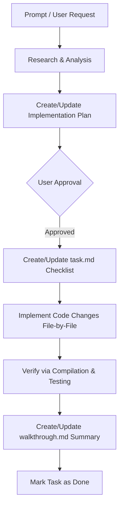

# AI Context - LinkOps

This document serves as the permanent, single source of truth for the project context, technical stack, architecture, coding guidelines, and rules for all future AI coding agents working on LinkOps.

---

## Project

* **Project Name**: LinkOps
* **Tagline**: Industrial Knowledge Intelligence Platform (Connect. Understand. Operate.)
* **Vision**: Transform fragmented industrial knowledge into a unified operational intelligence platform by connecting documents, assets, maintenance history, engineering knowledge, compliance records, and real-time sensor data into a single AI-powered system.
* **Problem Statement**: Industrial operations are plagued by fragmented knowledge siloed across unstructured files, P&IDs, SOPs, historical maintenance records, and regulatory requirements. This lack of integration leads to troubleshooting delays, higher operational risks, compliance gaps, and suboptimal decision-making.
* **Solution Overview**: An enterprise-grade, modular monolith architecture providing a single source of truth. It integrates transactional Postgres storage, Neo4j knowledge graphs, pgvector-based semantic search, and multi-agent AI workflows to resolve complex industrial queries and automate compliance verification.

---

## Current Development Status

* **Sprint Completed**: Sprint 1 (Foundation Setup - Setup FastAPI and Next.js projects, defined basic architecture layout, and created basic health check APIs)
* **Current Sprint**: Sprint 2 (Document Module Foundation - Established the directory structure, enums, exceptions, schemas, and router/service/repository placeholders for the documents feature module)
* **Next Milestone**: Sprint 3 (Database and Ingestion Core - PostgreSQL database models and Alembic migrations, Neo4j driver configurations, Vector store integrations, and binding the Document model)

---

## Technology Stack

### Frontend
* **Core**: Next.js 15 (App Router), React 19, TypeScript
* **State Management**: Zustand
* **Data Fetching**: TanStack React Query
* **Forms & Validation**: React Hook Form, Zod
* **Styling**: Tailwind CSS, PostCSS
* **Icons & Animation**: Lucide React, Framer Motion

### Backend
* **Core**: FastAPI, Python 3.12, Uvicorn
* **ORM & Database Drivers**: SQLAlchemy 2.0, Psycopg 3, Neo4j Python Driver
* **Migrations**: Alembic
* **Background Tasks**: Celery, Redis
* **HTTP Client**: HTTPX
* **Logging**: Standard Python logging with Request ID middleware tracing

### Databases
* **Relational**: PostgreSQL (for core platform data, metadata, transactional states)
* **Graph**: Neo4j (for asset topology, dependency modeling, and industrial ontology)
* **Vector Store**: pgvector (extension in PostgreSQL for semantic RAG indices)

### Storage
* **Object Store**: MinIO (for local development/testing) or AWS S3 compatible stores for documents and media

### Caching
* **In-Memory Cache**: Redis (caching, coordination lock, Celery message broker)

### AI
* **LLM Core**: Gemini 3.5 (Flash and Pro models)
* **Framework**: Multi-agent orchestrations, semantic RAG pipelines, Graph RAG integrations

### Deployment
* **Scaffolding**: Local Docker Compose (Postgres, Neo4j, Redis, MinIO, Celery worker)
* **Production**: Containerized Docker images targeted for Kubernetes

---

## Backend Architecture

The backend follows Clean Architecture, Domain-Driven Design (DDD) principles, and feature-based modularity:
* `app/core`: Configuration settings, security helper functions, logging setups, and standard application constants.
* `app/api`: FastAPI external HTTP route contracts. Mirroring endpoints for routing and versioning control (e.g. `v1`).
* `app/modules`: Contains feature-oriented domain modules (e.g., `documents`, `auth`, `assets`, `knowledge`). Each module maintains its own domain layer (enums, models, schemas, repository, service, router, exceptions, constants) keeping business logic separated from the framework.
* `app/services`: Cross-cutting integration adapters (e.g., infrastructure dependency health reports).
* `app/database`: Persistence layer configurations for Postgres, Neo4j, Redis, and Object Storage.
* `app/ai`: AI-specific boundaries for prompt templates, agent flows, and retrieval logic.
* `app/workers`: Asynchronous worker tasks driven by Celery.
* `app/events`: Event handlers and integration messages.
* `app/shared`: Stable shared utilities, common response definitions, and error schemas.

---

## Frontend Architecture

The frontend uses Next.js App Router and is organized to ensure modular scalability:
* `app`: Contains the application shell, layout, global providers, and routing configurations.
* `components`: Reusable layout, UI elements, and base components (e.g., button, modal).
* `features`: Product-facing functional modules (e.g., asset viewer, document browser).
* `hooks`: Custom React hooks for sharing stateful logic.
* `services`: API query integrations and server request wrappers.
* `store`: Client-side state managers powered by Zustand.
* `types`: Shared TypeScript type definitions and interfaces.
* `styles`: Global CSS styles and Tailwind configuration overrides.
* `lib`: Third-party framework wrappers and utility libraries.

---

## Coding Standards

### Naming Conventions
* **Python (Backend)**:
  * Variable, function, and file names: `snake_case`
  * Classes: `PascalCase`
  * Constants: `UPPERCASE_SNAKE_CASE`
* **TypeScript/JavaScript (Frontend)**:
  * Variable, function, and file names: `camelCase` (React components use `PascalCase`)
  * Interfaces, Types, Classes: `PascalCase`
  * Style variables and constants: `UPPERCASE_SNAKE_CASE` or `camelCase` depending on usage

### Python Style
* Strict PEP 8 styling.
* Type hints required on all function arguments and return types.
* Prefer Python 3.12 features (e.g., `enum.StrEnum` for string-based enums).

### TypeScript Style
* Enable TypeScript strict mode.
* Avoid the use of `any` types; define explicit interfaces or use utility types.
* Explicitly type function returns on API routes and key components.

### Folder Structure
* Maintain a feature-based organization. Keep frontend component assets grouped by feature, and backend modules grouped by domain concern inside `modules/`.

### Docstring Policy
* **Every module (file) and class MUST have a clear, descriptive docstring** summarizing its purpose.
* Public functions and methods should have a docstring documenting parameters, return values, and behavior.

---

## AI Rules

* **Never redesign architecture**: Adhere strictly to the modular structure and design boundaries defined in `docs/Architecture.md`.
* **Never rename folders**: Existing directory layouts (frontend, backend, modules, etc.) must remain unchanged.
* **Never modify unrelated files**: Focus edits exclusively on the targeted issue scope.
* **One task per prompt**: Resolve one logical concern at a time.
* **Stop after completing assigned task**: Do not proactively add extra endpoints, features, or boilerplate code outside the prompt specifications.
* **Keep responses concise**: Provide brief, direct summaries of files changed.
* **Preserve backward compatibility**: Ensure new interfaces do not break existing modules or components.

---

## Future Modules

* **Documents**: Document ingestion, classification, indexing, and revision management.
* **Assets**: Equipment catalog, topology representation, and site logs.
* **Knowledge Graph**: Entity extraction, relationship mapping, and graph database population.
* **OCR**: Layout parsing, engineering schematic analysis (P&IDs), and drawing metadata extraction.
* **AI**: Multi-agent coordinator, prompt management, and RAG evaluation tools.
* **Copilot**: Natural language question-answering assistant and step-by-step procedure guidance.
* **Analytics**: Equipment status reporting, operational downtime, and pattern recognition.
* **Mission Control**: Plant-wide status dashboards and visual monitoring.
* **Authentication**: Enterprise identity providers (SSO/OAuth2) and role-based access control (RBAC).
* **Lessons Learned**: Database of historical anomalies, corrective actions, and troubleshooting search index.
* **Search**: Global search combining relational queries, graph traversals, and semantic indexing.
* **Compliance**: Safety guidelines, standard operating procedures, and automated audit checks.

---

## Sprint Roadmap

* **Sprint 1 (Foundation Setup)**: Set up development scaffolding, containerized services (Compose), and base routing.
* **Sprint 2 (Document Module Foundation)**: Build foundational placeholder classes, enums, constants, exceptions, and router configuration for the `documents` domain.
* **Sprint 3 (Database & Ingestion Core)**: Define SQLAlchemy models, run Alembic migrations, initialize Neo4j connection interfaces, and implement vector database indexes.
* **Sprint 4 (Ingestion & OCR Service)**: Set up object storage file uploads, layout extraction services, and PDF parser integration.
* **Sprint 5 (AI Copilot & Knowledge Graph)**: Deploy multi-agent RAG pipelines, graph construction logic, and copilot conversational endpoints.
* **Sprint 6 (Operational Analytics & Live Telemetry)**: Connect live IoT SCADA sensors, set up Redis/Celery queue events, and integrate live telemetry dashboard feeds.
* **Sprint 7 (Enterprise Readiness & Compliance Audits)**: Implement compliance checking agent, audit trail logs, enterprise authentication, and deploy to Kubernetes.

---

## Development Workflow

1. **Prompt**: The developer details the requirements of a specific coding task.
2. **Implementation Plan**: The agent creates `implementation_plan.md` to map out affected files and boundaries.
3. **Approval**: Wait for approval. Once approved, create `task.md` to track execution.
4. **Execution**: Perform the minimal changes required without editing unrelated files.
5. **Verification**: Run compilation, tests, or static checks. Document changes and visual proofs in `walkthrough.md`.
6. **Commit**: Save and move to the next task.
